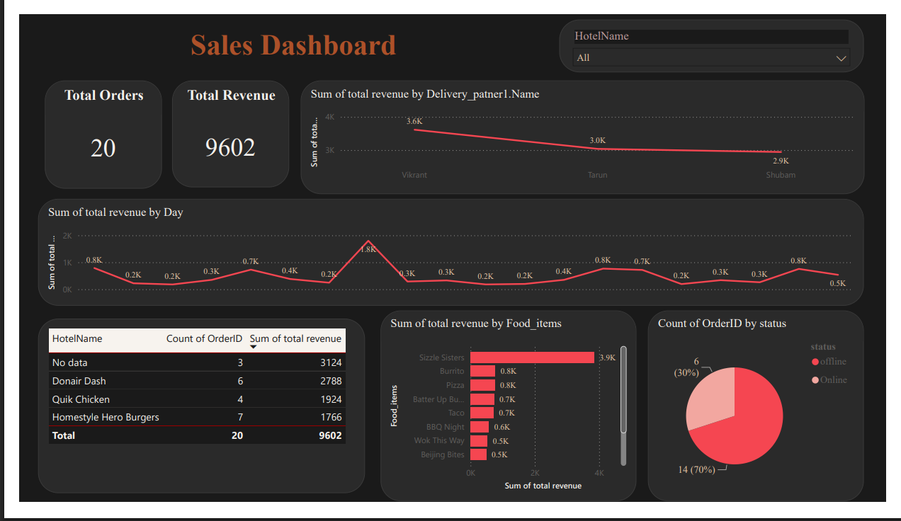

# Sales Performance & Revenue Insights

## 📊 Project Overview

This project presents an interactive retail sales analytics dashboard developed using Microsoft Power BI.

The dashboard transforms raw sales, product, territory, calendar, and returns data into actionable business insights related to revenue performance, order volume, product performance, and returns.

The project demonstrates the use of data cleaning, data modelling, DAX, Power Query, and interactive data visualisation in Power BI.

## 🖼️ Dashboard Preview

## 🎯 Business Objectives

The dashboard was designed to answer key business questions such as:

- What is the overall sales revenue?
- How many orders have been placed?
- How is revenue changing over time?
- Which products generate the highest revenue?
- What is the return quantity?
- How does sales performance vary across different periods?

## 🛠️ Tools & Technologies

- Microsoft Power BI
- Power Query
- Microsoft Excel / CSV
- Data Modelling
- Data Cleaning
- Data Visualisation

